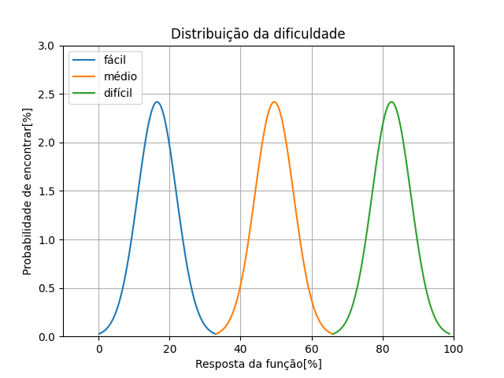

# SUPER CERVEJA
### _O super trunfo das cervejas brasileiras_
Esse projeto tem como objetivo utilizar o cunteúdo aprendido na matéria de programação III(EMB5631). Para isso, foi construído um jogo super trunfo sobre algumas das cervejas brasileiras.

## 1. REGRAS DO JOGO
O jogo é multijogdador, para tanto, algumas regras foram levemente modificadas. Assim, para iniciar o jogo é nescessário informar a quantidade de jogadores.

Em seguida, deve-se informar os devidos nomes dos jogadores, se será um bot ou um jogador e, caso seja um bot, também é nescessário informar qual a dificuldade.

O jogo começa com o próximo jogador que receberia cartas. Por exemplo:
|jogador A|jogador B|jogador C|
|:-------:|:-------:|:-------:|
|10 cartas|10 cartas|9  cartas|

Assim, o jogador C começará. Em seguida, o jogador escolherá um dos atributos das cartas e aquele que tiver o maior valor levará todas as cartas. Ou seja, caso o jogador B ganhe teremos:
|jogador A|jogador B|jogador C|
|:-------:|:-------:|:-------:|
|9  cartas|12 cartas|8  cartas|

Por fim, ganha quem levar todas as cartas dos oponentes.

O trunfo é a cerveja Guinness representado pelo índice __*0@*__ e ele automaticamente ganha a rodada, com exceção das cartas classe __*A*__.

## 2. Estrutura de código
O código está estruturado em entre classes *cards*, *decks*, *jogador* e *jogo*. Para tanto estão divididos:
|Cards|Deck |Jogador|Jogo |
|:---:|:---:|:-----:|:---:|
|Armazena as propriedades de cada carta| Constroi o deck que distribuirá as caras|Armazena as propriedades de cada jogador|armazena e aplica as regras do jogo|

### Para isso o método *Cards* contém:

Uma característica importante da carta é que ela tem a capacidade de ser enxergada como um vetor, indo do index 0(tato) e o index 4(aparência). Ou seja, também existe sobrecarga de operador[].
 1. Modificar as variáveis através das funções set
 1. Acessar as variáveis através das funções get 
 1. maxStat: retorna a posição com maior stats
 1. print: imprime em tela a carta

### Para o método *Deck* contém:

1. print_id: imprime apenas o número e a classe das cartas do deck
1. copy_cards: copia todas as cartas do deck 
1. shuffle: embaralha as cartas do deck
1. print: imprime todas as cartas deck
1. add_card: adiciona cartas no deck
1. pick_card: pega uma carta do deck

Para essa classe foi feita sobrecarga do "=" para poder receber um vetor de cartas

### Para o método *Jogador* contém:

1. Modificar as variáveis através das funções set
1. Acessar as variáveis através das funções get
1. add_card: adiciona a carta no final da mão
1. pick_card: pega a carta do topo da mão
1. print_id: imprime o número e classe de cada carta da mão
1. is_ended: verifica se o jogador ainda está no jogo
1. back: passa uma cópia da carta do topo da mão

Para essa classe foi feita sobrecarga do operador "+=" para poder receber um uma carta

### Para o método *Jogo* contém:

1. mount_jogadores: monta os jogadores no jogo
1. mount_deck: contrói o deck com as cartas do jogo
1. shuffle: embaralha o deck
1. card_dist: distribui as cartas embaralhadas para os jogadores
1. bot_play: realiza a jogada do bot
1. gamer_play: realiza a jogada do jogador
1. verify_end: verifica se o jogo acabou
1. jogo_start: inicia o jogo

## 3. Funcionamento das estruturas
Para fins informartivos, a dificuldade do bot é construída dividindo três curvas normalizadas em torno de 33, 66 e 99 em uma escala 0-100. Ou seja, o bot fácil na média terá como valor de dificuldade 16,5%, médio de 49,5% e difícil 82,5%.

<center>

</center>

Assim, existe um comportamento variado entre os intervalos de dificuldade. O método de comportamento do bot é ditado pelo melhor valor da rodada, assim quando for a vez do bot jogar um valor entre 0 e 100 é uniformente sorteado e, então, se o valor for maior que a dificuldade do bot terá seu termo alterado.

Exemplo: em certa altura do jogo o Bot_A com 82 de dificuldade escolheria o valor (2) por ser a melhor opção, porém, se na roleta for sorteado um valor maior que 82 terá sua escolha alterada.

```txt
RODADA 47
Jogador Bot_A está avaliando 2

Bot_A DECK(15)
(3A)-----------------------------+
|Nome: Magnifica São Luís        |
+--------------------------------+
|(0)Tato: 45                     |
|(1)Aroma: 50                    |
->|(2)Sabor: 65                    |
|(3)Balanço: 60                  |
|(4)Aparência: 10                |
+--------------------------------+

Bot_B DECK(14)
(5B)-----------------------------+
|Nome: Colorado                  |
+--------------------------------+
|(0)Tato: 50                     |
|(1)Aroma: 30                    |
->|(2)Sabor: 35                    |
|(3)Balanço: 25                  |
|(4)Aparência: 20                |
+--------------------------------+
```

